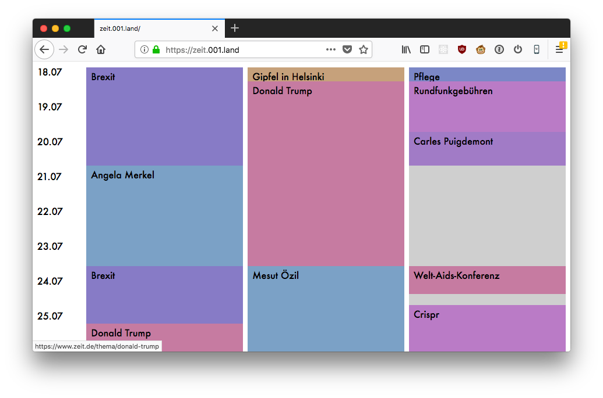

# Schwerpunkt

Erfasst regelmäßig die Schwerpunkt-Themen auf Zeit-Online um eine visuelle 
Timeline als HTML-Datei zu erstellen.



## Setup

Virtualenv mit Python3 erstellen und

```bash
pip install -r requirements.txt
```

Dann olgenden Cronjob mit `crontab -e` erstellen um das Skript jede Stunde auszuführen 
(Pfade anpassen).

```bash
0 * * * * cd schwerpunkt && venv/bin/python schwerpunkt/main.py >> cron.log 2>&1
```
